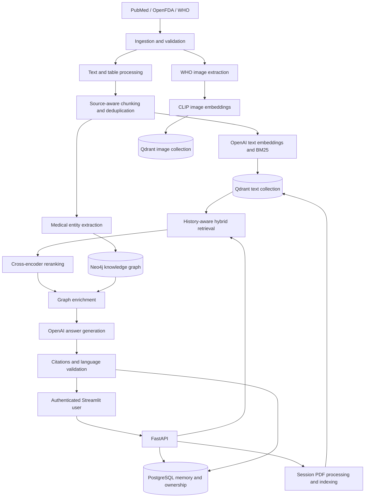

# MedRAG

**Multilingual medical knowledge assistant powered by retrieval-augmented generation.**

MedRAG retrieves evidence from **PubMed research**, **OpenFDA drug labels**, **WHO guidelines**, and private chat uploads. It combines hybrid search, cross-encoder reranking, knowledge-graph enrichment and conversation memory to generate answers with source citations.

Built as an **AI/ML engineering portfolio project**, it demonstrates the progression from notebook experiments to a modular application, automated testing, Docker packaging and GitHub Actions. It is an educational demonstration, not a clinically validated medical service.

## Project links

| Resource | Link or placeholder |
|---|---|
| Source code | [GitHub repository](https://github.com/moizishere-droid/medrag) |
| Automated checks | [GitHub Actions](https://github.com/moizishere-droid/medrag/actions) |
| Live application | `TODO: LIVE_DEMO_URL` |
| Backend API | `TODO: BACKEND_API_URL` |
| Interactive API documentation | `TODO: BACKEND_API_URL/docs` |
| OpenAPI specification | `TODO: BACKEND_API_URL/openapi.json` |
| Demo video | `TODO: DEMO_VIDEO_URL` |
| Hugging Face Space/model card, if used | `TODO: HUGGING_FACE_URL — remove if unused` |
| Hosting platform | `TODO: SELECTED_HOSTING_PLATFORM` |

Replace placeholders after deployment. No public deployment is claimed here.

<!-- Optional screenshot after deployment:

Create the image before enabling this Markdown.
-->

## Features

- **Hybrid retrieval:** OpenAI dense embeddings and BM25 sparse search in Qdrant, combined with reciprocal rank fusion.
- **Evidence reranking:** a cross-encoder selects final evidence; CPU inference defaults to full-precision ONNX.
- **Graph enrichment:** relevant structured drug–disease information from Neo4j.
- **Conversation memory:** contextual follow-ups can be rewritten using previous messages before retrieval.
- **Multilingual answers:** response language follows the latest question, rather than earlier answers or source-document language.
- **Citations:** retrieved evidence is associated with answers; entries from the same document are grouped.
- **Private chats and uploads:** account-owned sessions and PDF evidence scoped to the chat where it was indexed.
- **Persistent storage:** PostgreSQL stores accounts, sessions, messages, citations and upload metadata.
- **Streamlit UI:** persistent sign-in, chat selection, immediate question display, thinking indicator, first-question chat titles, PDF upload and topic/source panel.
- **Automated verification:** unit, API, frontend, integration and packaged startup checks.

**Multilingual does not mean a fixed six-language limit.** The application detects the current query language and instructs the OpenAI model to answer accordingly. Detection and generation can be imperfect; ambiguous short medical terms default to English. A detected answer-language mismatch is retried once and rejected if it persists.

The repository also implements **WHO table/image extraction, CLIP image embeddings and image-to-text links**. These demonstrate multimodal data engineering. The current chat accepts text questions and PDFs, not image questions.

## Architecture



Image indexing is a separate pipeline, not an image input to the chat flow.

## Sources and topic scope

| Source | Evidence |
|---|---|
| [PubMed](https://pubmed.ncbi.nlm.nih.gov/) | Research article records and available abstracts from NCBI |
| [OpenFDA](https://open.fda.gov/) | Drug indications, dosage, warnings, contraindications, adverse reactions and interactions |
| [WHO](https://www.who.int/) | Guideline PDF text, tables and figures |
| User-uploaded PDFs | Extractable text available only in the chat where it was indexed |

The curated ingestion scope contains **36 topics**:

| Area | Topics |
|---|---|
| Metabolic | Diabetes, hypertension, obesity, hyperlipidemia |
| Respiratory | Asthma, COPD, pneumonia, tuberculosis |
| Cardiovascular | Coronary artery disease, heart failure, stroke, arrhythmia |
| Infectious | Malaria, dengue fever, HIV/AIDS, hepatitis B, COVID-19, typhoid |
| Mental health | Depression, anxiety disorder |
| Gastrointestinal and liver | Peptic ulcer disease, irritable bowel syndrome, hepatitis C |
| Musculoskeletal | Osteoarthritis, rheumatoid arthritis, osteoporosis |
| Thyroid | Hypothyroidism, hyperthyroidism |
| Neurological | Epilepsy, migraine, Parkinson's disease |
| Other | Chronic kidney disease, breast cancer, lung cancer, anemia in pregnancy, malnutrition |

Coverage varies across topics and sources. This list does not guarantee an answer to every question or WHO coverage for every topic. Answers are prompted to use retrieved evidence, but grounding remains model behavior that requires evaluation.

### Saved corpus snapshot

| Source | Unique text chunks |
|---|---:|
| PubMed | 4,725 |
| OpenFDA | 13,167 |
| WHO | 4,804 |
| **Total** | **22,696** |

These counts describe reviewed local artifacts, not data automatically provisioned in a new deployment. Corpus collection, embedding and indexing are separate from application startup.

## Technology stack

| Layer | Technologies |
|---|---|
| Application | Python, FastAPI, Pydantic, Streamlit |
| LLM | OpenAI API; default answer model `gpt-4.1-nano` |
| Dense embeddings | `text-embedding-3-small`, 1,536 dimensions |
| Retrieval | Qdrant, BM25 via FastEmbed, reciprocal rank fusion |
| Reranking | `cross-encoder/ms-marco-MiniLM-L-6-v2`, Sentence Transformers, ONNX Runtime |
| Medical entities | spaCy, scispaCy |
| Persistence | Neo4j, PostgreSQL, psycopg2 |
| Documents and images | pdfplumber, PyMuPDF, CLIP ViT-B/32, Pillow |
| Evaluation/testing | RAGAS, pytest, coverage, Streamlit AppTest |
| Delivery | Docker, Docker Compose, GitHub Actions, GitHub Container Registry release workflow |

Pinned dependencies: [backend](backend/requirements.txt) and [frontend](frontend/requirements.txt).

## Repository structure

```text
medrag/
├── .github/                 # CI, release workflow and dependency updates
├── backend/
│   ├── config/              # Typed environment settings
│   ├── scripts/             # Ingestion, indexing, evaluation and verification
│   └── src/medrag/
│       ├── api/             # Routes, authentication and API models
│       ├── ingestion/       # Curated sources and session uploads
│       ├── processing/      # Chunking and processing models
│       ├── embeddings/      # Text/image embeddings and Qdrant access
│       ├── retrieval/       # Hybrid search and reranking
│       ├── ner/             # Medical entity extraction
│       ├── knowledge_graph/ # Neo4j ingestion and queries
│       ├── generation/      # Answers and language selection
│       ├── citations/       # Source resolution and grouping
│       ├── memory/          # PostgreSQL chat memory
│       └── evaluation/      # RAGAS evaluation
├── frontend/                # Streamlit UI and browser auth bridge
├── deploy/                  # Dockerfile and isolated CI services
├── tests/                   # Unit, API, frontend and integration tests
├── notebooks/               # Phase experiments and validation
├── docs/                    # Phase reports, performance and readiness
├── data/                    # Saved source and processed artifacts
├── docker-compose.yml       # Local database services
├── .env.example             # Environment template
├── install.bat              # Windows installation
└── pyproject.toml           # Package and pytest configuration
```

## Local setup

### Prerequisites

- **Python 3.11** is the verified runtime; package metadata supports 3.10–3.12.
- Docker with Compose for PostgreSQL, Qdrant and Neo4j.
- OpenAI API key and PubMed contact email.
- Internet access for initial dependencies/model downloads. Live AI calls incur charges.

### 1. Clone and install

```bash
git clone https://github.com/moizishere-droid/medrag.git
cd medrag
```

Windows PowerShell:

```powershell
.\install.bat
.\venv\Scripts\Activate.ps1
Copy-Item .env.example .env
$env:PYTHONPATH = "backend;backend/src"
```

Linux/macOS:

```bash
python3.11 -m venv venv
source venv/bin/activate
python -m pip install --upgrade pip
python -m pip install -r backend/requirements.txt
python -m pip install -e . --no-deps
cp .env.example .env
export PYTHONPATH=backend:backend/src
```

### 2. Configure `.env`

Fill the template without committing credentials:

| Setting | Purpose |
|---|---|
| `OPENAI_API_KEY`, `PUBMED_EMAIL` | Required settings |
| `NCBI_API_KEY`, `OPENFDA_API_KEY` | Optional ingestion credentials |
| `QDRANT_URL` | Vector database address |
| `NEO4J_URI`, `NEO4J_USER`, `NEO4J_PASSWORD` | Graph connection |
| `POSTGRES_HOST`, `POSTGRES_PORT`, `POSTGRES_DB`, `POSTGRES_USER`, `POSTGRES_PASSWORD` | Account/chat database connection |
| `AUTH_REQUIRED` | Defaults to true; keep enabled when hosted |
| `AUTH_TOKEN_HOURS` | Token/cookie lifetime; default 24 hours |
| `AUTH_COOKIE_SECURE`, `CORS_ORIGINS` | HTTPS cookies and exact allowed frontend origins |
| `MEDRAG_API_URL` | Backend address reachable by Streamlit |
| `MEDRAG_BROWSER_API_URL` | Backend address reachable by the browser |
| `RETRIEVAL_WARMUP` | Load retrieval models before accepting requests |
| `RERANK_BACKEND`, `RERANK_THREADS` | Defaults: ONNX and four CPU threads |

Example database passwords and open ports are for local development. Hosting requires private networking and new secrets. Use the same browser hostname for frontend/API to restore login cookies; localhost on both works with different local ports. Set `AUTH_COOKIE_SECURE=true` with HTTPS.

### 3. Start databases and populate the corpus

```bash
docker compose up -d
```

The API initializes its PostgreSQL application schema. Qdrant and the curated Neo4j graph must be populated before meaningful retrieval. Given prepared artifacts, indexing entry points are:

```bash
python backend/scripts/run_qdrant_ingestion.py
python backend/scripts/run_graph_ingestion.py
```

Read the scripts and [Qdrant](docs/phase09_report.md)/[graph](docs/phase13_report.md) reports before running against existing databases. Do not use collection-reset options on databases containing uploads.

To reproduce source/artifact preparation, follow the phase reports and notebooks. Entry points include:

```bash
python backend/scripts/run_ingestion.py
python backend/scripts/run_openfda_ingestion.py
python backend/scripts/run_who_ingestion.py
python backend/scripts/run_chunking.py
python backend/scripts/run_embeddings.py
python backend/scripts/run_image_embeddings.py
python backend/scripts/run_image_chunk_linking.py
```

These steps can download substantial data and consume paid embedding calls. They are not required on every restart; use existing artifacts when appropriate.

### 4. Start the application

In the configured environment:

```bash
python -m uvicorn medrag.api.main:app --app-dir backend/src --host 127.0.0.1 --port 8000
```

In a second terminal, activate the environment and run:

```bash
python -m streamlit run frontend/streamlit_app.py
```

- UI: [http://localhost:8501](http://localhost:8501)
- API documentation: [http://localhost:8000/docs](http://localhost:8000/docs)
- Health: [http://localhost:8000/health](http://localhost:8000/health)

Register, create a chat and ask a question. Optionally upload a text-based PDF. Initial startup includes model loading or ONNX export; subsequent starts reuse local model caches.

## API overview

| Method | Route | Purpose |
|---|---|---|
| GET | `/health` | Dependency status |
| GET | `/auth/config` | Authentication configuration |
| POST | `/auth/register` | Create account |
| POST | `/auth/login` | Issue token/cookie |
| POST | `/auth/logout` | Revoke token and clear cookie |
| POST | `/sessions` | Create owned chat |
| GET | `/sessions` | List user's chats |
| GET | `/sessions/{session_id}` | Read owned chat history |
| POST | `/sessions/{session_id}/documents` | Index chat-scoped PDF |
| POST | `/chat` | Retrieve, answer and persist a turn |

Private routes require a bearer token or HttpOnly session cookie. Swagger documents actual request/response schemas.

Example authenticated chat body:

```json
{
  "session_id": "<UUID returned by POST /sessions>",
  "message": "What is type 2 diabetes?"
}
```

## Privacy and upload isolation

- Authenticated accounts own their sessions; other accounts cannot access them.
- Published uploaded chunks are retrievable only in their original chat, alongside curated evidence.
- Retrieval with an omitted isolation key returns **curated evidence only**.
- Trusted internal callers can explicitly enable `full_corpus_evaluation=True`. It cannot be combined with a user ID and is not a public chat option.
- Staged/unpublished uploads are excluded from retrieval.
- Refresh/sign-out clears the browser file picker, not successfully indexed content. The same account and chat can still retrieve it. A persistent uploaded-file list is pending.

See the [isolation contract](docs/retrieval_isolation.md). Do not submit sensitive patient information to this portfolio demo.

## Testing and evaluation

Ordinary tests, without paid AI calls:

```bash
python -m pytest -q
```

With local database services running:

```bash
python -m pytest -m "integration and not live" -q
python -m pytest -m "not live" -q
```

Integration tests use a guarded PostgreSQL test database, temporary Qdrant collections and read-only graph checks. CI provisions disposable services with a synthetic graph.

| Evidence | Measured result |
|---|---|
| Local review, 7 October 2026 | **304 ordinary + 50 integration tests passed** |
| Earlier combined Linux coverage | **89.24%**; CI floor is 85% |
| Historical paired warm latency samples | **4.6–5.8 seconds** optimized versus 9.1–16.0 seconds before |

Latency comparisons preserved the same ordered top-five evidence for the tested queries. They exclude startup, browser rendering and some route overhead, and are not hosting/concurrency guarantees. RAGAS results include documented judge variability and unreliable-metric findings. Live evaluation and benchmarking require an explicit decision to incur API costs.

Reports: [testing](docs/phase21_report.md), [performance](docs/performance_report.md), [RAGAS](docs/phase17_report.md).

## CI/CD and deployment

GitHub Actions validates workflows/source syntax, tests ordinary and integration behavior, checks coverage, builds containers and verifies packaged startup/authentication on pull requests, main pushes and manual runs. The release workflow reruns checks before publishing commit-tagged backend/frontend images to GitHub Container Registry.

The Dockerfile has `test`, `backend` and `frontend` targets. Root Compose is a local database setup; `deploy/compose.ci.yml` is an isolated test setup. Public hosting configuration remains pending.

**Current status:** all local tests pass, but the latest reviewed main-commit GitHub run failed a timing-sensitive login rate-limit test. An earlier run passed. Registry publication and public deployment have not been verified. See [Phase 22](docs/phase22_report.md) and the [current readiness review](docs/deployment_readiness_report.md).

Before public launch: resolve the CI test, dependency advisories, request deadlines/cost limits, health/readiness behavior and auth-bridge checks. Configure HTTPS, secrets, persistent private databases, corpus restore, backups and rollback on the chosen platform.

## Limitations and roadmap

- Educational use; answers may be incomplete or incorrect and do not replace professional medical advice.
- Topic/language coverage varies; grounding and language checks do not guarantee perfect responses.
- Scanned PDFs require OCR, which is not implemented.
- Image extraction/indexing exists; image-question chat does not.
- Persistent upload listing/deletion in the UI is pending.
- Network delays, CPU work, answer length and concurrency affect latency.
- Deployment hardening and dependency triage remain open.

Next milestone: **a persistent, tested portfolio deployment with working demo and API links**.

## Phase documentation

Experiments: [notebooks](notebooks/). Decisions, validation and limitations: [docs](docs/).

| Phases | Reports |
|---|---|
| 00–01: architecture/environment | [00](docs/phase00_report.md), [01](docs/phase01_report.md) |
| 02–04: source ingestion/WHO processing | [02](docs/phase02_report.md), [03](docs/phase03_report.md), [04](docs/phase04_report.md) |
| 05–07: chunking/text/image embeddings | [05](docs/phase05_report.md), [06](docs/phase06_report.md), [07](docs/phase07_report.md) |
| 08–11: storage/sparse/hybrid/reranking | [08](docs/phase08_report.md), [09](docs/phase09_report.md), [10](docs/phase10_report.md), [11](docs/phase11_report.md) |
| 12–13: entities/knowledge graph | [12](docs/phase12_report.md), [13](docs/phase13_report.md) |
| 14–17: generation/citations/memory/evaluation | [14](docs/phase14_report.md), [15](docs/phase15_report.md), [16](docs/phase16_report.md), [17](docs/phase17_report.md) |
| 18–20: API/uploads/frontend | [18](docs/phase18_report.md), [19](docs/phase19_report.md), [20](docs/phase20_report.md) |
| 21: testing/UI/performance | [21](docs/phase21_report.md), [UI follow-up](docs/phase21_ui_followup.md), [performance](docs/performance_report.md) |
| 22: CI/release delivery | [22](docs/phase22_report.md) |
| Cross-phase reviews | [Project audit](docs/project_audit_report.md), [deployment readiness](docs/deployment_readiness_report.md) |

Phase reports are historical snapshots. Deployment verification should identify the final tested commit.

## Author and attribution

Developed by **Abdul Moiz** — [GitHub](https://github.com/moizishere-droid).

- Portfolio: `TODO: PORTFOLIO_URL`
- LinkedIn: `TODO: LINKEDIN_URL`

Medical content remains attributable to its original authors/source organizations. Third-party models, datasets and libraries retain their respective licenses. Citations do not imply endorsement.

## License

`TODO: Choose a code license and add LICENSE before claiming a specific license.`

Code licensing does not replace terms applicable to medical documents, datasets or model weights.
