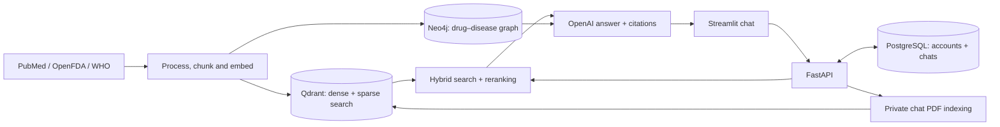

# MedRAG

**A multilingual medical knowledge assistant built with retrieval-augmented generation (RAG).**

MedRAG searches PubMed research, OpenFDA drug labels and WHO guidelines, then answers questions with citations. Users can add PDFs to a private chat. This AI/ML portfolio project shows the journey from notebook experiments to a tested, Docker-packaged application.

## Why MedRAG?

Medical information is spread across papers, drug labels and guideline PDFs. MedRAG brings that evidence into one conversation and helps users find the original sources. It demonstrates retrieval, model integration, data engineering and application delivery in one project.

**Educational demo:** answers may be wrong or incomplete. This is not a clinically validated service or a substitute for medical care.

## Features

- **36 curated medical topics**, including diabetes, hypertension, asthma and dengue; coverage varies.
- Dense embedding search and BM25 sparse search, followed by cross-encoder reranking.
- Drug–disease knowledge graph enrichment and conversation history.
- Multilingual answers following the question's language, without a fixed six-language limit.
- Citations and available WHO source tables/figures. Original source excerpts keep their original language.
- Sign-in, saved chats and private PDF evidence scoped to the chat where it was uploaded.

Chat accepts text questions and PDFs. Image extraction and CLIP embeddings exist in the data pipeline; image-question chat is not implemented. Translations and generated medical wording still need review.

## Architecture



**Stack:** Python, FastAPI, Streamlit, OpenAI API, Qdrant, Neo4j, PostgreSQL, ONNX Runtime, Docker and GitHub Actions.

## Run with Docker

Install Docker Desktop with Linux containers, or Docker Engine with Compose. You need your own OpenAI API key and internet access for the first build/model downloads. API usage may incur charges.

In PowerShell:

```powershell
git clone https://github.com/moizishere-droid/medrag.git
cd medrag
Copy-Item deploy/local.env.example deploy/local.env
notepad deploy/local.env
```

Fill your API key, contact email and two different database passwords (20+ characters recommended). Keep this file private. Then run:

```powershell
docker compose --env-file deploy/local.env -f deploy/compose.local.yml up -d --build
```

Open **[http://localhost:8501](http://localhost:8501)**. API docs: **[http://localhost:8501/api/docs](http://localhost:8501/api/docs)**.

Docker starts the API, UI and databases, and initializes the curated corpus from the repository's saved chunks, embeddings and prepared graph. First startup can take several minutes. Later starts reuse persistent data and model caches. If port 8501 is occupied, set `MEDRAG_LOCAL_PORT=8503` in `deploy/local.env` and open `http://localhost:8503`.

```powershell
# Check status and startup progress
docker compose --env-file deploy/local.env -f deploy/compose.local.yml ps -a
docker compose --env-file deploy/local.env -f deploy/compose.local.yml logs --tail=100 bootstrap api ui proxy

# Stop while retaining data
docker compose --env-file deploy/local.env -f deploy/compose.local.yml down
```

Do not add `-v` unless you intend to delete this stack's data. Images are built locally from source; published registry images are not yet verified. Root `docker-compose.yml` starts only development databases.

Details: [Docker quickstart](deploy/README.local.md) · [manual development](deploy/README.development.md) · [public HTTPS hosting](deploy/README.md).

## Repository guide

| Folder | Purpose |
|---|---|
| `backend/` | Retrieval, generation, API, ingestion and storage |
| `frontend/` | Streamlit interface |
| `data/` | Prepared corpus and source assets |
| `notebooks/` | Experiments before source implementation |
| `tests/` | Unit, API, frontend and integration checks |
| `deploy/` | Docker packaging and verification tools |
| `docs/` | Phase reports, decisions and evidence |
| `.github/` | CI checks and image release workflow |

## Project phases

| Phases | Reports |
|---|---|
| 00–01: architecture/environment | [00](docs/phase00_report.md), [01](docs/phase01_report.md) |
| 02–04: source ingestion/WHO processing | [02](docs/phase02_report.md), [03](docs/phase03_report.md), [04](docs/phase04_report.md) |
| 05–07: chunking/text/image embeddings | [05](docs/phase05_report.md), [06](docs/phase06_report.md), [07](docs/phase07_report.md) |
| 08–11: storage/sparse/hybrid/reranking | [08](docs/phase08_report.md), [09](docs/phase09_report.md), [10](docs/phase10_report.md), [11](docs/phase11_report.md) |
| 12–13: entities/knowledge graph | [12](docs/phase12_report.md), [13](docs/phase13_report.md) |
| 14–17: generation/citations/memory/evaluation | [14](docs/phase14_report.md), [15](docs/phase15_report.md), [16](docs/phase16_report.md), [17](docs/phase17_report.md) |
| 18–20: API/uploads/frontend | [18](docs/phase18_report.md), [19](docs/phase19_report.md), [20](docs/phase20_report.md) |
| 21: testing/UI/performance | [21](docs/phase21_report.md), [UI follow-up](docs/phase21_report.md#ui-follow-up), [performance](docs/performance_report.md) |
| 22: CI/release delivery | [22](docs/phase22_report.md) |
| Cross-phase reviews | [Project audit](docs/phase21_report.md#project-audit), [deployment readiness](docs/deployment_preparation_report.md#historical-readiness) |

Reports preserve historical snapshots. Current evidence: [deployment preparation](docs/deployment_preparation_report.md). Specific contracts: [retrieval isolation](docs/retrieval_isolation.md), [source visuals](docs/source_visuals.md), [performance](docs/performance_report.md).

## Testing and deployment status

GitHub Actions runs tests, coverage checks, container builds and packaged startup checks. A separate release workflow supports publishing tested images to GitHub Container Registry; it does not deploy a host.

Current local verification passed **404 Python tests and 5 browser-script tests**, plus seven Docker route checks and six authentication/persistence checks. The corpus gate verified all three sources and the prepared graph. These changes need their own green GitHub CI before release. Software tests do not prove medical accuracy; live review found remaining wording and grounding limitations.

Docker is the current delivery target. Railway or AWS will be chosen later. Public hosting still needs a host/domain, final CI, secrets, backups and hosted verification.

## Project links

| Resource | Link |
|---|---|
| Repository | [GitHub](https://github.com/moizishere-droid/medrag) |
| CI | [GitHub Actions](https://github.com/moizishere-droid/medrag/actions) |
| Live demo | `TODO: LIVE_DEMO_URL` |
| Hosted API docs | `TODO: https://YOUR_DOMAIN/api/docs` |
| Demo video | `TODO: DEMO_VIDEO_URL` |

## Author and licensing

**Abdul Moiz** · [GitHub](https://github.com/moizishere-droid)

A project code license has not been selected. Source documents, datasets and model weights retain their original terms and attribution.

Modal deployment preparation: [setup and cloud database requirements](deploy/README.modal.md). This target is not publicly deployed yet.
